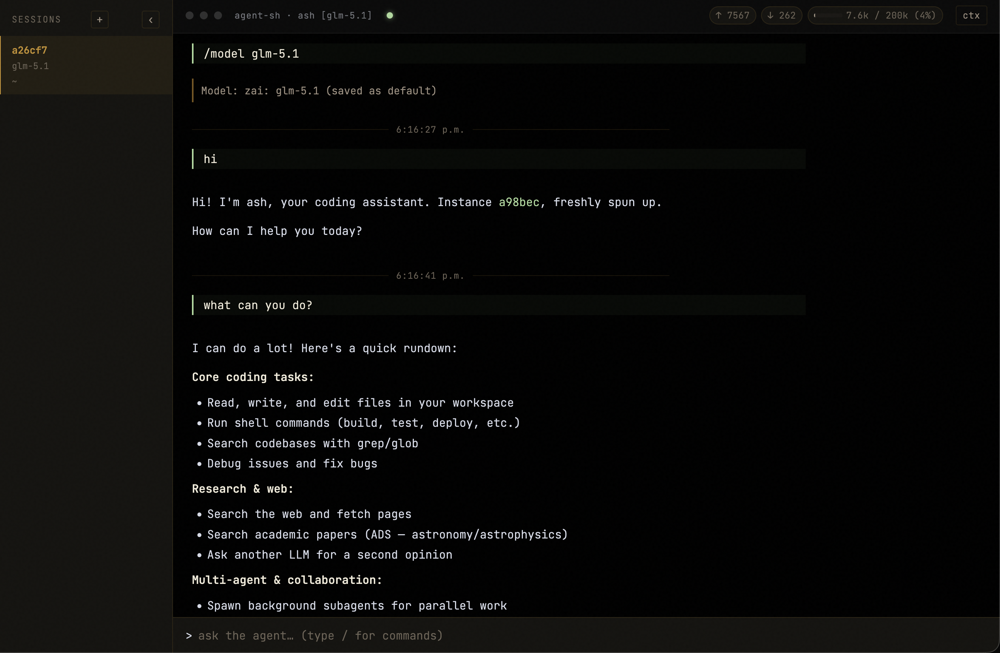

# Agent SH Hub

A standalone desktop application that hosts one or more [agent-sh](https://github.com/guanyilun/agent-sh) sessions and serves them through a web UI on a single port. No terminal required: open the app, spawn a session, talk to the agent, drop into another session, edit the live context — all through a native desktop interface.



## Highlights

- **Multi-session** — every session runs in isolation; sidebar lets you spawn (`+`), switch, and close (`×`) on the fly.
- **Live streaming** — the same SSE event firehose ash uses internally, rendered in the browser. Markdown, syntax-highlighted code, file diffs, tool calls.
- **Pluggable backend** — defaults to running ash's kernel in-process (`ash` bridge). Swap to `acp` to talk to any ACP-speaking agent (e.g. Claude Code's ACP server) with `--backend acp --cmd ...`.
- **Context inspection** — `ctx` button opens a panel that lists every message in the live conversation with role, position, and token estimate. Tick a box, hit `drop`, watch consecutive runs collapse into a single in-place placeholder so the agent retains chronology while shedding tokens.
- **Desktop native** — packaged as macOS (Apple Silicon) and Windows apps with native directory picker and auto-updater support.

## Install

### Pre-built Binaries

Download the latest release from [GitHub Releases](https://github.com/firslov/agent-sh-hub/releases):

- **macOS** (Apple Silicon): `Agent SH Hub-x.x.x-arm64.dmg` or `.zip`
- **Windows** (x64): `Agent SH Hub Setup x.x.x.exe` or `.exe` (portable)

> **macOS Note:** This app is not signed with an Apple Developer ID. On first open, macOS may show "Agent SH Hub is damaged and can't be opened". This is Gatekeeper's stricter handling of unsigned apps. To fix:
> ```bash
> # Option 1: Remove the quarantine attribute (recommended)
> xattr -dr com.apple.quarantine "/Applications/Agent SH Hub.app"
>
> # Option 2: Allow the app in System Settings > Privacy & Security
> # After attempting to open, go to System Settings > Privacy & Security > Security
> # and click "Open Anyway" next to the blocked app.
> ```

### From Source

```sh
git clone https://github.com/firslov/agent-sh-hub
cd agent-sh-hub && npm install && npm link
```

## Run

### Desktop App

```sh
npm run electron:dev      # development mode with DevTools
npm run electron:dist:mac # build macOS app (arm64)
npm run electron:dist:win # build Windows app (x64)
```

### CLI / Server Mode

```sh
agent-sh-hub                            # in-process ash, port 7878
agent-sh-hub --port 8080
agent-sh-hub --backend acp --cmd "claude-code-acp"
```

Open <http://127.0.0.1:7878/>. The first visit shows an empty sidebar — click `+` to spawn a session.

### Flags

| Flag                  | Default          | Description                                         |
|-----------------------|------------------|-----------------------------------------------------|
| `--port N`            | `7878`           | HTTP port                                           |
| `--host HOST`         | `127.0.0.1`      | Bind host                                           |
| `--web PATH`          | bundled          | Static web root                                     |
| `--backend ash\|acp`  | `ash`            | Bridge implementation                               |
| `--model NAME`        | settings default | Model override (ash backend)                        |
| `--provider NAME`     | settings default | Provider override (ash backend)                     |
| `--cmd "CMD ARGS"`    | `agent-sh-acp`   | Spawn command (acp backend)                         |

### Backends

- **`ash`** — runs the agent-sh kernel directly in the hub process. Smallest moving parts; uses your `~/.agent-sh/settings.json`, providers, and user extensions (TUI-only ones are skipped automatically).
- **`acp`** — spawns one JSON-RPC subprocess per session. Use this with any ACP-compatible agent. Permission requests auto-approve until the web UI grows a yes/no prompt.

## Endpoints

| Method | Path                       | Description                                  |
|--------|----------------------------|----------------------------------------------|
| GET    | `/`                        | Web UI; redirects to first session if any    |
| GET    | `/sessions`                | JSON list of live sessions                   |
| POST   | `/sessions`                | Spawn a session: `{ cwd?: string }`          |
| GET    | `/<id>/`                   | Web UI for session                           |
| GET    | `/<id>/events`             | SSE event stream                             |
| POST   | `/<id>/submit`             | Submit a query: `{ query: string }`          |
| GET    | `/<id>/context`            | Snapshot: `{ messages, contextWindow, activeTokens }` |
| POST   | `/<id>/context/rewind`     | Drop trailing messages: `{ toIndex: N }`     |
| POST   | `/<id>/context/drop`       | Drop arbitrary indices: `{ indices: [...] }` |
| DELETE | `/<id>/`                   | Close session                                |

## Architecture

```
browser ──HTTP/SSE──> hub ──Bridge──> agent (in-process or subprocess)
                        │                  │
                        │                  └── agent-sh kernel / ACP child
                        │
                        └── per-session: replay buffer, segment synthesis,
                                         SSE fanout, context endpoints
```

The **Bridge** interface (`src/bridges/types.ts`) is the seam: `submit`, `cancel`, `snapshot`, `compact`, plus event subscription. Drop a new file in `src/bridges/` to add another backend.

## Adding a backend

```ts
export class MyBridge extends EventEmitter implements Bridge {
  ready()    { /* initialize */ }
  submit(t)  { /* run a turn, emit "event" with BusEvents */ }
  snapshot() { /* return live message array if you support it */ }
  compact(s) { /* mutate context if you support it */ }
  // ...
}
```

Then wire it in `cli.ts`'s `makeFactory`.

## Compatibility with custom agent-sh backends

The `ash` bridge runs ash's kernel in-process and assumes the conventions of the kernel's default `agent-backend`. If you register a different backend via `agent:register-backend`, two contracts decide whether the hub's UI keeps working:

**Bus events the UI renders.** The panel expects the standard event set — `agent:processing-start`/`-done`, `agent:response-chunk`, `agent:tool-started`/`-completed`, `agent:usage`, `agent:info`, `permission:request`. Custom backends that follow these (most do, since the TUI relies on the same shape) Just Work. A backend that skips `processing-done` will leave the spinner spinning; one that emits text via a custom event won't stream.

**Context source of truth.** `GET /<id>/context` and the drop/rewind endpoints go through the kernel's `context:snapshot` and `context:compact` pipes, which read and mutate ash's `ConversationState`. Backends that share `ConversationState` (the default pattern) get accurate snapshots and working drops. Backends that keep a private message store will see the panel show *kernel-side* messages, not what the backend actually sends to its model — and `drop` will edit kernel state the backend ignores.

If you ship a backend with its own context, advise the `context:snapshot` and `context:compact` handlers to read and write your own store. The seam already supports that.

## Extension Loading

User extensions from `~/.agent-sh/extensions/` are automatically loaded on startup. Extensions that use `import.meta.dirname` (Node.js v20.11.0+) are fully supported. Extensions that would conflict with the hub (e.g. web-renderer binding port 7878) should check `process.env.AGENT_SH_UNDER_HUB` and bail early.

## Status

Beta. Localhost only by default. Auth, multi-host hubs, and a permission-prompt UI are future work.
